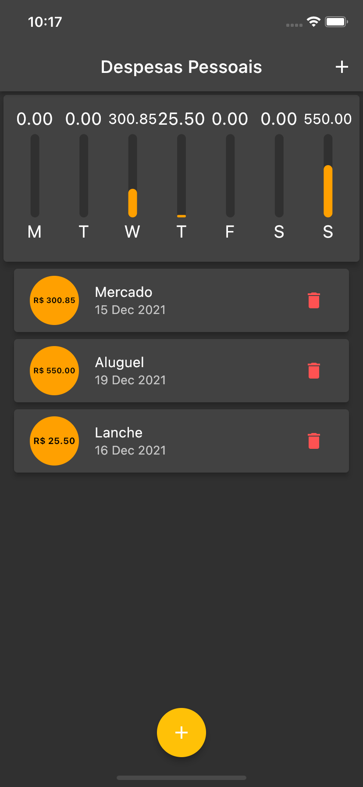
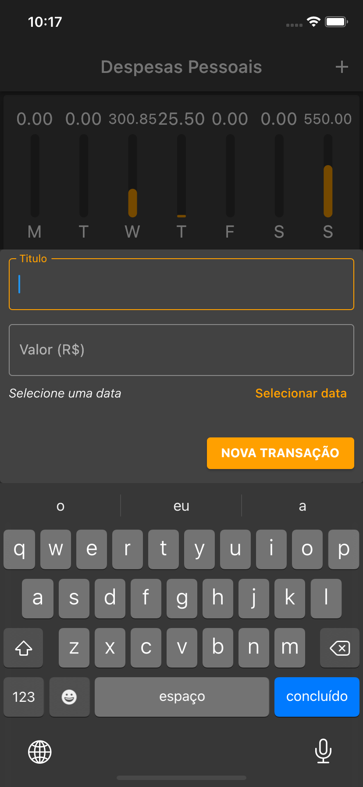
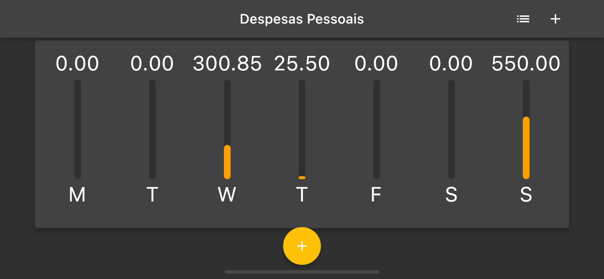
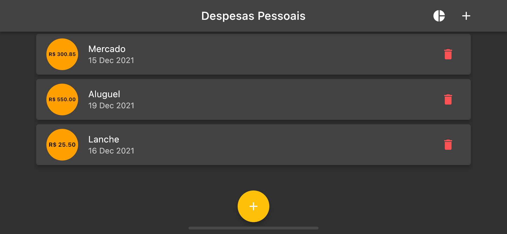

# cod3r_expenses
## Sobre
  expenses é uma aplicação simples com o objetivo de aprender os fundamentos do dart e flutter.

  - É um projeto do curso de flutter da Cod3r, o aplicativo tem como objetivo cadastrar os gastos do usuario e exibi em uma lista.

  - O aplicativo exibe um grafico com os gastos  dos últimos 7 dias na parte superior.

## Aprendizado
- Layout responsivo utilizando `LayoutBuilder` e o `MediaQuery`.
- Alterar estado com `setState`.
- Diferenças dos Widgets do `Material` e `Cupertino`.
- Trabalhar com datas fazendo comparações e formatando com `Intl`.
